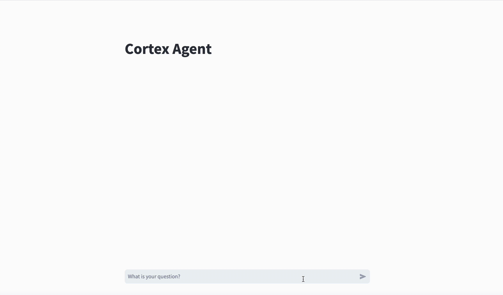

# Getting Started with Cortex Agents



## Overview
This project utilizes Snowflake Cortex Agents to analyze sales conversations and extract actionable insights. 
By leveraging semantic search and AI-driven analytics, the platform enables sales teams to gain deeper visibility into 
customer interactions, sales performance, and deal outcomes.

The core functionalities include:

- Sales conversation analysis using Snowflake Cortex Search
- Semantic search over sales data utilizing Cortex Analyst
- Use Cortex Agents to use both under one API

In this quickstart you will:
- Create a Cortex Search Service
- Create a Semantic Model for Cortex Analyst
- Create a Data Agent that can use Cortex Search and Cortex Analyst
- Create a streamlit application to chat with the Agent via the API

## Step-By-Step Guide
You can follow this guide here or in the [QuickStart Guide](https://quickstarts.snowflake.com/guide/getting_started_with_cortex_agents/index.html#0)

#### 1. Run setup script
First, let's get your account setup with some sample data. Run the script in `setup.sql` in a worksheet, with 
[snowsql](https://docs.snowflake.com/en/user-guide/snowsql), or any other way you prefer.
If you with to use a pre-existing database, schema, and warehouse, skip the first two steps of the setup script.

#### 2. Upload semantic model
Upload the Semantic Model yaml `sales_metrics_model.yaml`.

In Snowsight:
- Navigate to Data (Or Catalog » Database Explorer) » Databases » SALES_INTELLIGENCE » DATA » Stages » MODELS
- Click "+ Files" in the top right
- Browse and select sales_metrics_model.yaml file
- Click "Upload"

Or with `snowsql` run: `PUT file://sales_metrics_model.yaml @sales_intelligence.data.models AUTO_COMPRESS=false;`

#### 3. Create a PAT token to call the Snowflake REST APIs
In Snowsight:
- Click on your profile (bottom left corner) » Settings » Authentication
- Under `Programmatic access tokens`, click `Generate new token`
- Select `Single Role` and select `sales_intelligence_rl`
- Copy and save the token for later (you will not be able to see it again)

#### 4. Create the Agent using UI, ignore following
Run the following command on your terminal to create an Agent via the REST API, replacing the PAT token and account URL.
You can find your account URL in Snowsight: Click on your profile (bottom left corner) » Account » View account details.
```
curl -X POST https://{ACCOUNT_URL}/api/v2/databases/snowflake_intelligence/schemas/agents/agents \
-H 'Content-Type: application/json' \
-H 'Accept: application/json' \
-H 'Authorization: Bearer {PAT_TOKEN}' \
-d @create_agent.json
```

Alternatively, you can create the Agent in Snowsight navigating to AI & ML » Agents » Create Agent (see step by step 
in the [QuickStart Guide](https://quickstarts.snowflake.com/guide/getting_started_with_cortex_agents/index.html?index=..%2F..index#3)).

After creating you can chat with the Agent via Snowflake Intelligence.
In Snowsight, click on AI & ML » Snowflake Intelligence, select the `SALES_INTELLIGENCE_AGENT` in the chat bar, and ask
any questions you'd like!

#### 5. Run the streamlit
Now that you have created your agent, run the sample streamlit to interact with it.
Make sure to populate the PAT and HOST params correctly.
(Note: this guide was built using Python 3.11)

```
python3 -m venv venv
source venv/bin/activate
pip3 install -r requirements.txt


streamlit run data_agent_demo.py
```

The streamlit uses python code auto-generated using https://openapi-generator.tech/. It creates the pydantic classes in
`/models` for the request and response objects based on the OpenAPI spec at `cortexagent-run.yaml`. You can regenerate
those files by running the script `openapi-generator.sh` (assuming you have docker installed and running locally).
